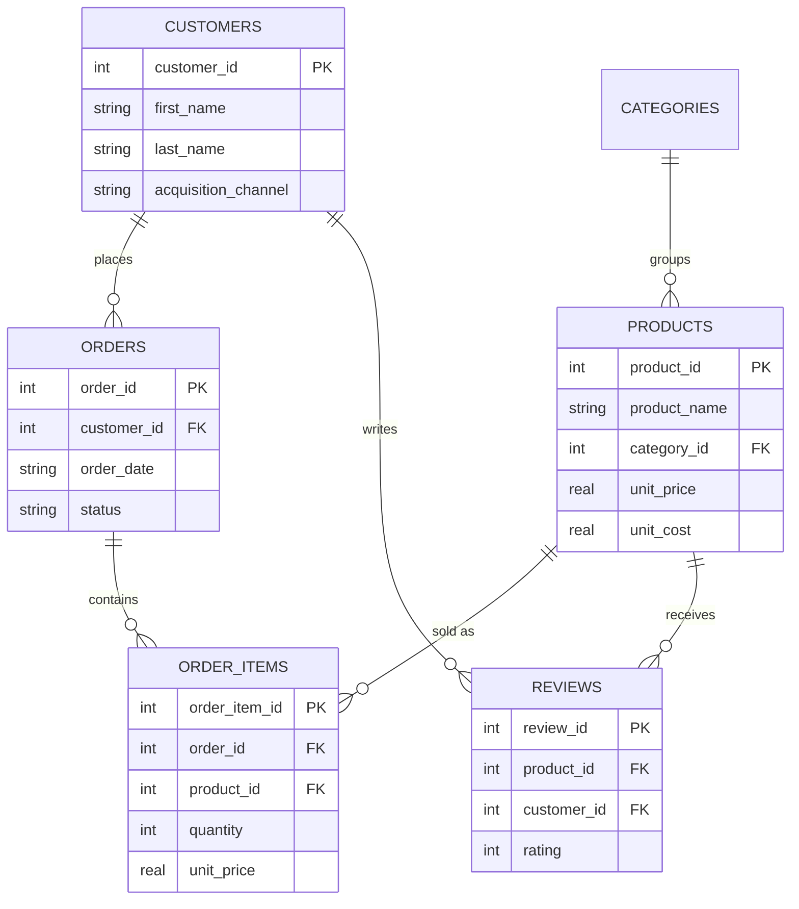

# E-commerce Retail Analytics (SQL)

A self-contained SQL portfolio project simulating an online retailer —
customers, products, orders, and reviews — with analysis queries covering
the kind of reporting a retail/e-commerce analytics team runs regularly:
revenue and margin by category, customer segmentation (RFM), cohort
retention, and basket analysis.

Built with SQLite so it runs anywhere with no server setup, using standard
ANSI SQL that ports easily to PostgreSQL / SQL Server / MySQL with minor
syntax changes.

## Why this project

Paired with the [banking operations project](../retail-banking-operations-analytics),
this one is deliberately industry-agnostic — it's meant to show general
commercial/analytics SQL (cohort retention, RFM, basket analysis) that's
directly transferable to consumer-facing business analyst or data analyst
roles, not just financial services.

## Entity-relationship diagram



## Project structure

```
.
├── schema.sql          -- DDL: tables, constraints, indexes
├── load_data.py         -- builds data/ecommerce.db from schema.sql + CSVs
├── queries.sql          -- all analysis queries, organised by technique
├── data/
│   └── csv/              -- raw seed data (customers, products, orders, ...)
└── README.md
```

## Getting started

```bash
git clone <this-repo>
cd ecommerce-retail-analytics
python load_data.py           # builds data/ecommerce.db
sqlite3 data/ecommerce.db     # open a shell and paste queries from queries.sql
# or: sqlite3 data/ecommerce.db < queries.sql
```

Requires Python 3 (standard library only, no dependencies) and optionally
the `sqlite3` CLI for exploring interactively.

## Dataset

Synthetic but internally consistent — generated with a fixed random seed so
results are reproducible.

| Table        | Rows  |
|--------------|-------|
| customers    | 600   |
| categories   | 8     |
| products     | 51    |
| orders       | 2,060 |
| order_items  | 3,854 |
| reviews      | 635   |

## What the queries cover

`queries.sql` is organised into five sections:

1. **Foundational lookups & joins** — recent completed orders, top products by revenue
2. **Aggregation & grouping** — revenue/margin by category, AOV by acquisition channel, return rate by payment method, `HAVING` for review-count filters
3. **CTEs** — RFM segmentation (`NTILE()`-based recency/frequency/monetary scoring), monthly cohort retention, churn-candidate detection
4. **Window functions** — running total revenue, `RANK()` of products within category, `LAG()` for days-between-orders, new-vs-repeat revenue split
5. **Basket analysis** — a self-join on `order_items` to find products frequently bought together

Sample — RFM segmentation:

```sql
WITH order_summary AS (
    SELECT o.customer_id, MAX(o.order_date) AS last_order_date,
           COUNT(DISTINCT o.order_id) AS frequency,
           SUM(oi.quantity * oi.unit_price) AS monetary
    FROM orders o JOIN order_items oi ON oi.order_id = o.order_id
    WHERE o.status = 'Completed'
    GROUP BY o.customer_id
),
scored AS (
    SELECT customer_id,
           NTILE(4) OVER (ORDER BY julianday(last_order_date) DESC) AS recency_score,
           NTILE(4) OVER (ORDER BY frequency ASC)                   AS frequency_score,
           NTILE(4) OVER (ORDER BY monetary ASC)                    AS monetary_score
    FROM order_summary
)
SELECT customer_id,
       CASE WHEN recency_score >= 3 AND frequency_score >= 3 AND monetary_score >= 3 THEN 'Champions'
            WHEN recency_score < 2 AND frequency_score < 2 THEN 'Lost'
            ELSE 'Regular' END AS rfm_segment
FROM scored;
```

## Possible extensions

- Feed the RFM output into an actual marketing-segment export (CSV)
- Extend cohort retention to a full retention curve chart (Python/matplotlib or a BI tool)
- Add a `marketing_spend` table and compute channel-level ROAS
